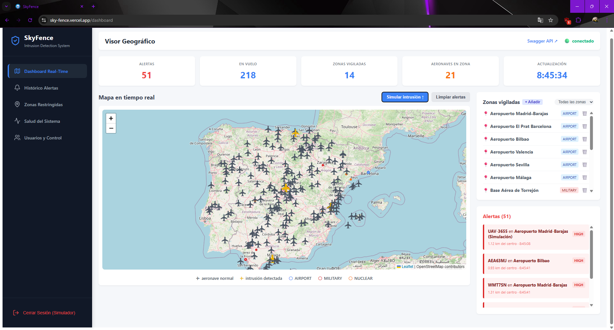
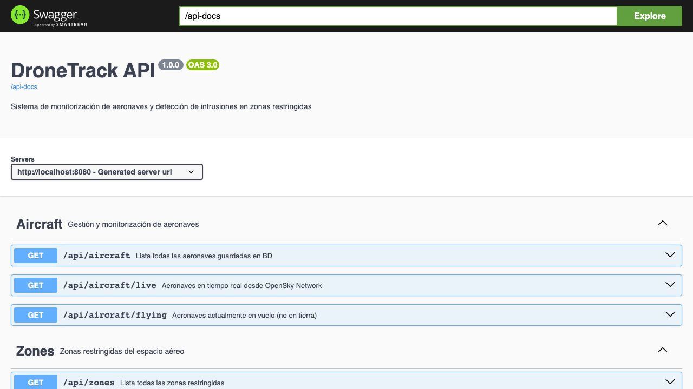

# SkyFence

> Detección de intrusiones en zonas restringidas en tiempo real

Sistema de monitorización de aeronaves que consume datos reales de [OpenSky Network](https://opensky-network.org), aplica geofencing con la fórmula de Haversine sobre zonas sensibles (aeropuertos, bases militares, centrales nucleares) y emite alertas instantáneas al frontend vía WebSocket/STOMP.


---

## Vista previa





---

## Arquitectura y flujo del sistema

```
OpenSky Network API
        │  (cada 10 segundos)
        ▼
  OpenSkyService  ──► GeofenceService (Haversine)
                              │
                    aeronave dentro de zona?
                              │
                        AlertService
                              │
                    WebSocket /topic/alerts
                              │
                        Frontend React
                    (mapa actualizado en tiempo real)
```

1. El backend consulta OpenSky Network cada 10 segundos filtrando el espacio aéreo de España.
2. Por cada aeronave, calcula la distancia a todas las zonas restringidas con la fórmula de Haversine.
3. Si una aeronave está dentro del radio de una zona, genera una alerta con severidad `HIGH` o `MEDIUM`.
4. La alerta se publica por WebSocket al frontend de forma instantánea.
5. El frontend actualiza el mapa en tiempo real: marcador rojo para aeronaves en alerta.
6. Los datos persisten en PostgreSQL entre reinicios.

---

## Stack tecnológico

| Capa | Tecnología |
|------|-----------|
| Lenguaje | Java 17 |
| Framework principal | Spring Boot 3.x |
| Dependencias | Maven |
| Base de datos | PostgreSQL 16 |
| ORM | Spring Data JPA + Hibernate |
| API HTTP | WebClient (WebFlux) |
| Alertas en tiempo real | Spring WebSocket + STOMP + SockJS |
| Documentación API | SpringDoc OpenAPI (Swagger) |
| Tests unitarios | JUnit 5 + Mockito |
| Tests de integración | MockMvc |
| Frontend | React 18 + Vite |
| Mapa | Leaflet + React-Leaflet |
| Cliente WebSocket | @stomp/stompjs + sockjs-client |
| Contenedores | Docker + Docker Compose |

---

## Estructura del proyecto

```
SkyFence/
├── backend/
│   ├── src/main/java/com/skyfence/
│   │   ├── config/
│   │   │   ├── WebSocketConfig.java
│   │   │   └── OpenApiConfig.java
│   │   ├── controller/
│   │   │   ├── AircraftController.java
│   │   │   └── ZoneController.java
│   │   ├── service/
│   │   │   ├── AircraftService.java
│   │   │   ├── GeofenceService.java
│   │   │   ├── AlertService.java
│   │   │   └── OpenSkyService.java
│   │   ├── repository/
│   │   │   ├── AircraftRepository.java
│   │   │   └── RestrictedZoneRepository.java
│   │   ├── model/
│   │   │   ├── Aircraft.java
│   │   │   ├── RestrictedZone.java
│   │   │   └── Alert.java
│   │   └── SkyFenceApplication.java
│   └── src/test/java/com/skyfence/
│       ├── service/
│       │   ├── GeofenceServiceTest.java     (Mockito — 7 casos)
│       │   └── AircraftServiceTest.java     (Mockito — 4 casos)
│       └── controller/
│           ├── AircraftControllerTest.java  (MockMvc — 3 casos)
│           └── ZoneControllerTest.java      (MockMvc — 4 casos)
├── frontend/
│   └── src/
│       ├── components/
│       │   ├── DroneMap.jsx
│       │   └── AlertPanel.jsx
│       ├── hooks/
│       │   └── useWebSocket.js
│       └── App.jsx
├── docker-compose.yml
└── README.md
```

---

## Ejecución con Docker

Levanta toda la aplicación (PostgreSQL + backend + frontend) con un solo comando:

```bash
docker-compose up --build
```

| Servicio | URL |
|---------|-----|
| Backend API | http://localhost:8080 |
| Swagger UI | http://localhost:8080/swagger-ui.html |
| Frontend | http://localhost:3000 |

```bash
# Parar conservando datos de PostgreSQL
docker-compose stop

# Parar y eliminar contenedores (datos persistidos en volumen)
docker-compose down
```

---

## Ejecución local (sin Docker)

**Requisitos:** Java 17, Maven, Node 20, PostgreSQL 16 en ejecución.

```bash
# Backend
cd backend
mvn spring-boot:run

# Frontend (en otra terminal)
cd frontend
npm install
npm run dev
```

---

## API REST

Documentación interactiva disponible en `http://localhost:8080/swagger-ui.html`.

| Método | Endpoint | Descripción |
|--------|----------|-------------|
| `GET` | `/api/aircraft` | Aeronaves persistidas en BD |
| `GET` | `/api/aircraft/live` | Aeronaves en tiempo real desde OpenSky |
| `GET` | `/api/aircraft/flying` | Solo aeronaves en vuelo (no en tierra) |
| `GET` | `/api/zones` | Zonas restringidas configuradas |
| `POST` | `/api/zones` | Añadir nueva zona restringida |
| `DELETE` | `/api/zones/{id}` | Eliminar zona por ID |

### WebSocket

- Endpoint STOMP: `ws://localhost:8080/ws`
- Topic de alertas: `/topic/alerts`

### Actuator (monitorización)

| Método | Endpoint | Descripción |
|--------|----------|-------------|
| `GET` | `/actuator/health` | Estado de salud (BD + OpenSky API) |
| `GET` | `/actuator/info` | Información de la aplicación |
| `GET` | `/actuator/metrics` | Métricas del sistema (JVM, HTTP, etc.) |

> El health check incluye un indicador personalizado para verificar la conexión con OpenSky Network API.

---

## Lógica de geofencing

La detección usa la **fórmula de Haversine**, que mide la distancia geodésica entre dos puntos sobre la superficie terrestre:

```
a = sin²(Δlat/2) + cos(lat1) · cos(lat2) · sin²(Δlon/2)
distancia = R · 2 · atan2(√a, √(1−a))     (R = 6371 km)
```

Clasificación de severidad:
- `HIGH` — aeronave a menos del 50 % del radio de la zona
- `MEDIUM` — aeronave dentro del radio pero a más del 50 %

---

## Zonas restringidas por defecto

| Nombre | Tipo | Coordenadas | Radio |
|--------|------|-------------|-------|
| Aeropuerto Madrid-Barajas | AIRPORT | 40.4983, -3.5676 | 5 km |
| Aeropuerto El Prat Barcelona | AIRPORT | 41.2974, 2.0833 | 5 km |
| Aeropuerto Bilbao | AIRPORT | 43.3011, -2.9106 | 4 km |
| Aeropuerto Valencia | AIRPORT | 39.4893, -0.4816 | 4 km |
| Aeropuerto Sevilla | AIRPORT | 37.4180, -5.8931 | 4 km |
| Aeropuerto Málaga | AIRPORT | 36.6749, -4.4991 | 4 km |
| Base Aérea de Torrejón | MILITARY | 40.4967, -3.4456 | 4 km |
| Base Naval de Rota | MILITARY | 36.6412, -6.3496 | 5 km |
| Base Aérea de Morón | MILITARY | 37.1749, -5.6159 | 4 km |
| Base Aérea de Zaragoza | MILITARY | 41.6662, -1.0415 | 4 km |
| Central Nuclear Cofrentes | NUCLEAR | 39.2503, -1.0636 | 3 km |
| Central Nuclear Almaraz | NUCLEAR | 39.8070, -5.6980 | 3 km |
| Central Nuclear Ascó | NUCLEAR | 41.2003, 0.5681 | 3 km |
| Central Nuclear Vandellós | NUCLEAR | 40.9247, 0.8769 | 3 km |

---

## Tests

```bash
cd backend
mvn test
```

Cobertura incluida:

**GeofenceServiceTest** (Mockito):
- Aeronave dentro de zona genera alerta
- Aeronave fuera de zona no genera alerta
- Aeronave sin coordenadas devuelve lista vacía
- Aeronave muy cercana al centro → severidad `HIGH`
- Aeronave en varias zonas simultáneamente → múltiples alertas
- Distancia Madrid-Barcelona ≈ 505 km (validación Haversine)
- Sin zonas configuradas → sin alertas

**AircraftServiceTest** (Mockito):
- `getAllAircraft` devuelve todas las aeronaves
- `getAllAircraft` devuelve lista vacía si no hay datos
- `getAircraftInFlight` devuelve solo aeronaves en vuelo
- `getAircraftInFlight` devuelve vacío si todas en tierra

**AircraftControllerTest** (MockMvc):
- `GET /api/aircraft` devuelve 200 con datos
- `GET /api/aircraft/live` devuelve 200
- `GET /api/aircraft/flying` devuelve 200

**ZoneControllerTest** (MockMvc):
- `GET /api/zones` devuelve 200 con zonas
- `GET /api/zones` devuelve lista vacía si no hay zonas
- `POST /api/zones` crea y devuelve la zona guardada
- `DELETE /api/zones/{id}` elimina la zona por ID

> Los tests usan un perfil `test` con H2 en memoria — no requieren PostgreSQL.

---

## Posibles mejoras

- Histórico de alertas persistido en BD con consulta por rango de fechas
- Panel de gestión de zonas en el frontend (añadir y eliminar desde la UI)
- Spring Actuator para endpoints `/health` y `/metrics`
- Simular intrusión con zona elegible desde el frontend
- Autenticación con JWT para proteger los endpoints
- MQTT para integración con sensores IoT reales en lugar de OpenSky
- Métricas con Prometheus + Grafana
- Pipeline CI/CD con DevSecOps (testing automatizado + análisis de seguridad antes de merge)
